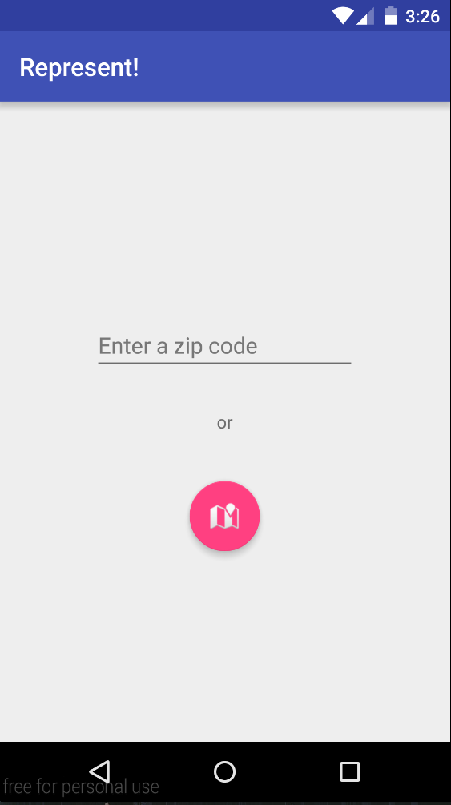
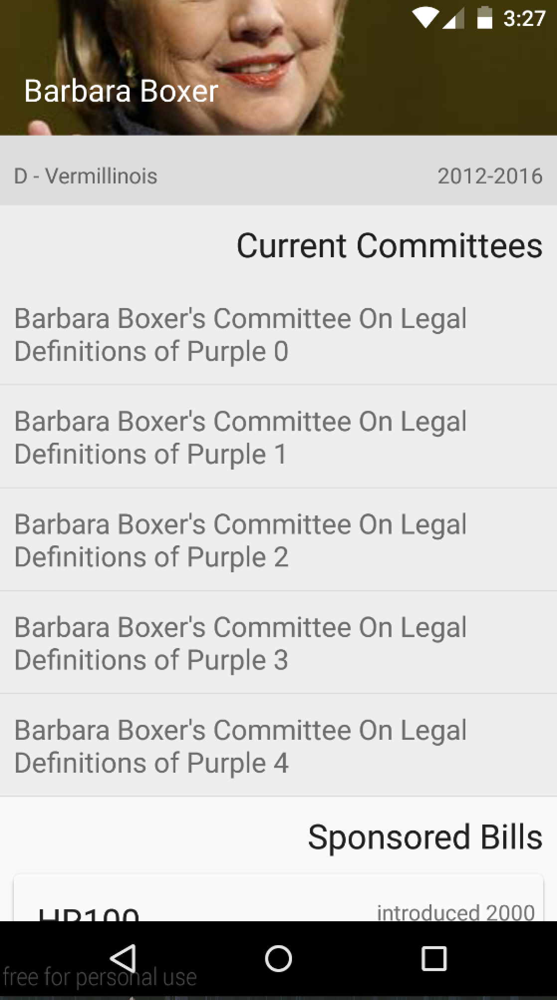
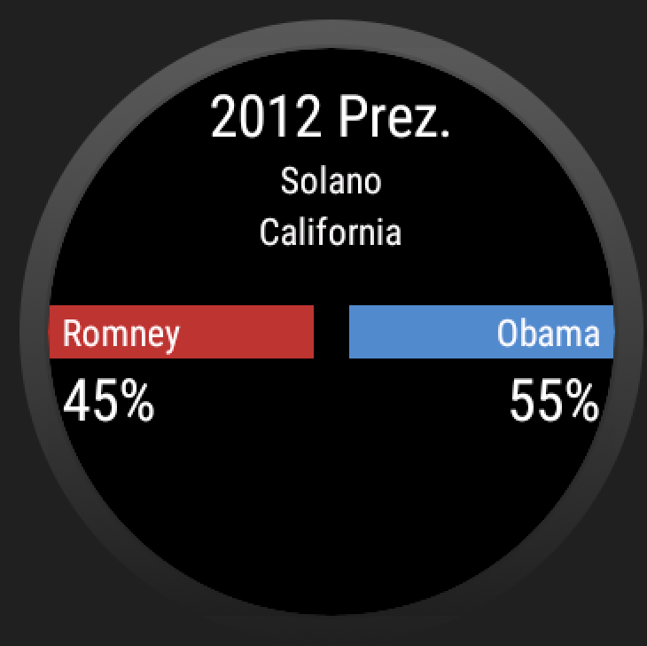

# PROG 02: Represent!

It does the things that it's supposed to, without searing out your eyes.

## Authors

Jeffrey Shi ([jeffster888@berkeley.edu](mailto:jeffster888@berkeley.edu))

## Demo Video

See [Represent!](https://youtu.be/vOD1yYuxdQg) in action

## Screenshots

## Acknowledgments

* Hat tip to Kanye for Ultralight Beam
* thanks to the noon, joleary, & diane 4 slides & the starter code
