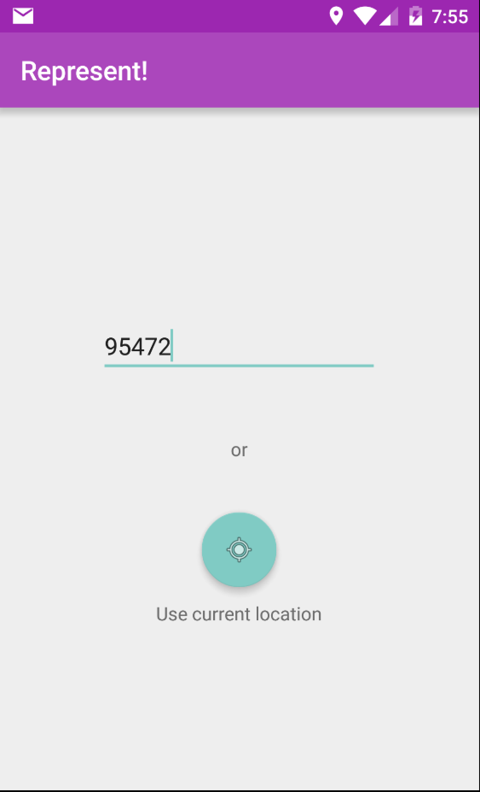
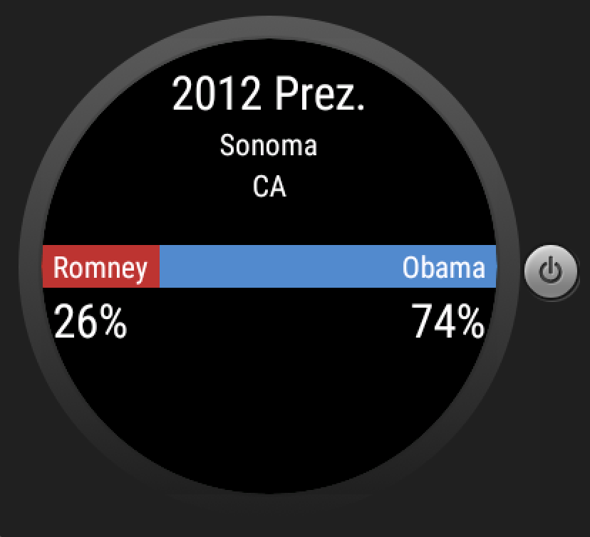

# PROG 02: Represent!

It does the things that it's supposed to, without searing out your eyes.

## Authors

Jeffrey Shi (jeffreyhyshi) ([jeffster888@berkeley.edu](mailto:jeffster888@berkeley.edu))

## Demo Video

See [Represent!](https://youtu.be/MaHlIHbE8ak) in action. WAIT THERE'S MORE SEE [REPRESENT!](https://youtu.be/Dfw2cW-dn9k) in EVEN MORE ACTION.

## Screenshots

## Acknowledgments

* Hat tip to Kanye for Ultralight Beam
* thanks to the noon, joleary, & diane 4 slides & the starter code
